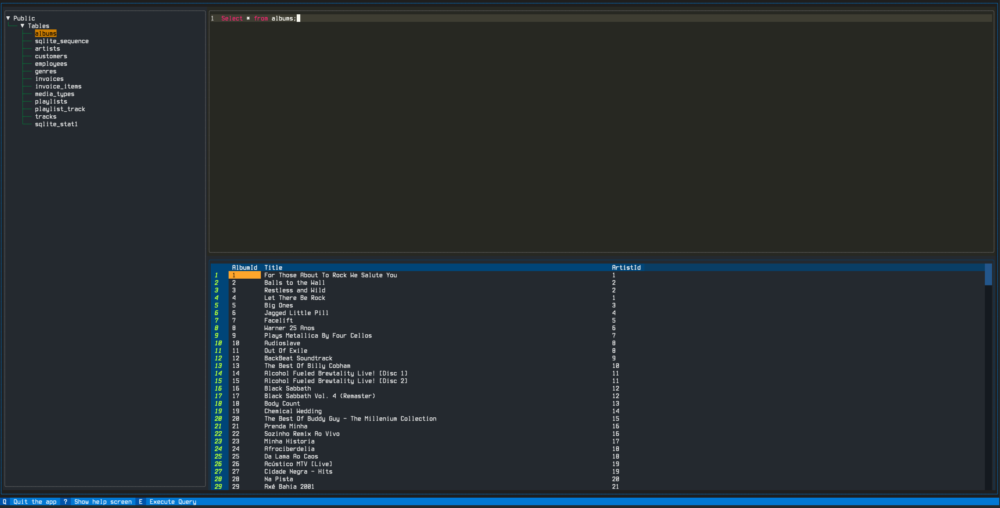

# The terminal DB client you've been waiting for.

Datapie is a tool made out of frustration in the lack of good terminal tools to handle database exploration and simple queries.

Disclaimer:
    Datapie is a **work in progress**, currently not being even considered alpha, come back at a later time to check it out.

## Aims

- ⚡️ Fast 
- 🔧 Easy to use and extend with plugins.
- 💻 Can be integrated into a full terminal workflow with Tmux.
- ⌨️  Vim-like keybindings and command mode for exporting and data-modification
